# Observability

Vidhijna includes request-level tracing, token and cost metrics, and per-role latency summaries via **Langfuse**. This document covers the observability stack, what the numbers mean, and what to improve.

**Status: Not deployed online. Observability is available locally only.**

---

## What Was Added

On the `feat/langfuse_integration` branch, the following changes were made:

### 1. Langfuse Tracing Integration (`agents/graph.py`)

```python
# agents/graph.py — lines 52–86

def _load_langfuse_handler() -> Optional[Any]:
    public_key = os.environ.get("LANGFUSE_PUBLIC_KEY", "").strip()
    secret_key = os.environ.get("LANGFUSE_SECRET_KEY", "").strip()
    host = os.environ.get("LANGFUSE_HOST", "").strip()
    if not (public_key and secret_key and host):
        return None
    try:
        from langfuse.langchain import CallbackHandler
        return CallbackHandler()
    except Exception:
        return None

LANGFUSE_HANDLER = _load_langfuse_handler()

def langfuse_status() -> dict[str, Any]:
    return {
        "enabled": LANGFUSE_HANDLER is not None,
        "public_key_set": bool(os.environ.get("LANGFUSE_PUBLIC_KEY", "").strip()),
        "host": os.environ.get("LANGFUSE_HOST", "").strip(),
    }
```

The `CallbackHandler` is attached to every graph run when enabled, and silently skipped when not — zero impact on production if env vars are absent.

### 2. Config Metadata (`agents/graph.py:build_runtime_config`)

```python
# agents/graph.py — lines 89–125

def build_runtime_config(
    thread_id: str,
    *,
    request_id: str = "",
    langfuse_trace_id: str = "",
    mode: str = "",
    model_used: str = "",
    user_id: str = "",
    extra_callbacks: Optional[list[Any]] = None,
) -> RunnableConfig:
    metadata = {
        "langfuse_session_id": thread_id,
        "langfuse_trace_id": langfuse_trace_id or request_id,
        "request_id": request_id,
        "thread_id": thread_id,
        "mode": mode,
        "model_used": model_used,
    }
    config: RunnableConfig = {
        "configurable": {"thread_id": thread_id},
        "metadata": metadata,
    }
    callbacks = list(extra_callbacks or [])
    if LANGFUSE_HANDLER is not None:
        callbacks.insert(0, LANGFUSE_HANDLER)
    if callbacks:
        config["callbacks"] = callbacks
    return config
```

### 3. Metrics Collector (`agents/metrics.py`)

```python
# agents/metrics.py — MetricsCollector (key methods)

class MetricsCollector(BaseCallbackHandler):
    def on_llm_end(self, response: Any, **kwargs: Any) -> None:
        # Tracks: prompt_tokens, completion_tokens, total_tokens,
        #         latency_ms, cost_usd, tokens_per_second

    def on_chain_end(self, outputs: dict, **kwargs: Any) -> None:
        # Tracks per-node latency for p95 calculation

    def compute_rag_observability(
        self, *, query, final_response, legal_chunks, book_chunks,
        web_results, citations, mode
    ) -> dict:
        # Returns: retrieval_relevance, context_utilization,
        #          citation_coverage, faithfulness_proxy, source_diversity
```

Key RAG scoring function (`agents/metrics.py:compute_rag_observability`):
- `retrieval_relevance` — average normalized cosine similarity of retrieved chunks against the query. Good: > 0.6. Bad: < 0.4
- `context_utilization` — token overlap between the final answer and retrieved context. Good: > 0.4. Bad: < 0.2
- `citation_coverage` — fraction of retrieved sources that actually appear in the citations list. Good: > 0.5. Bad: < 0.3
- `faithfulness_proxy` — weighted combo (65% utilization + 35% citation). Good: > 0.5. Bad: < 0.2
- `source_diversity` — ratio of unique sources to total chunks. Good: > 0.4. Bad: < 0.2

### 4. Metrics Endpoint (`backend/main.py`)

```
GET /metrics → {
  recent_requests[],      # raw per-call LLM events
  summary: { by_role, rag_observability, total_cost_usd, ... },
  p95_latency_ms: { node_name: ms }
}
```

---

## What You Get From Observability

### Token & Cost Metrics — What Good vs Bad Looks Like

| Metric | Good | Watch Out |
|---|---|---|
| `total_tokens` / request | 3,000–15,000 | > 30,000 may mean prompt bloat |
| `total_cost_usd` / request | < $0.005 | > $0.01 on 8B model suggests excessive calls |
| `avg_tokens_per_second` | > 1,500 tokens/s | < 500 tokens/s means model is slow on this input size |
| `by_role.research.prompt_tokens` | 8,000–20,000 per request | Spikes > 25,000 suggest redundant context passed in |

### Latency Metrics — What Good vs Bad Looks Like

| Metric | Good | Watch Out |
|---|---|---|
| `supervisor` p95 | < 800ms | > 1,500ms means LLM is stalling on classification |
| `propose_plan` p95 | < 3,000ms | > 10,000ms is the biggest offender in current traces |
| `summarize_books` p95 | < 5,000ms | > 30,000ms — this node is the top latency bottleneck |
| `summarize_web` p95 | < 3,000ms | > 5,000ms with low output tokens means the LLM is slow |
| `finalize` p95 | < 5,000ms | > 10,000ms means the final gen has too much context |
| `retrieve_legal` / `retrieve_books` | < 3,000ms | > 5,000ms means Pinecone is slow or too many candidates |
| `web_search` p95 | < 5,000ms | > 8,000ms means Tavily is slow or hitting rate limits |
| `reflect` p95 | < 1,500ms | > 3,000ms means the reflection prompt is too long |

### RAG Metrics — What Good vs Bad Looks Like

| Metric | Good | Bad | Notes |
|---|---|---|---|
| `retrieval_relevance` | > 0.60 | < 0.40 | If low, the query rewriting is off or Pinecone namespace is wrong |
| `context_utilization` | > 0.40 | < 0.20 | Low means the model ignores chunks and generates from memory |
| `citation_coverage` | > 0.50 | < 0.30 | Zero means citations list wasn't populated — a tracking bug |
| `faithfulness_proxy` | > 0.50 | < 0.20 | Weighted index of utilization + citation. Core grounding metric |
| `source_diversity` | > 0.40 | < 0.20 | Low means we're retrieving the same source repeatedly |

---

## Reading a Real Trace — What the Numbers Tell Us

Here's a real deep research trace from a single request (`t_obs_demo`). Here's how to read it:

### High-Level Summary
```
17 LLM calls
35,302 total tokens
$0.00487 total cost
106.8 second total latency
2 reflection loops
```

### Token Distribution
The `by_role` breakdown shows:
- **chat role** (supervisor + combine + response_formatter): 10 calls, 16,702 tokens, $0.00121
- **research role** (plan, retrieval, reflect, finalize): 7 calls, 18,600 tokens, $0.00122

The research model uses nearly as many tokens as the supervisor side despite doing far more work per call — expected for a deep research flow with large context chunks.

### The Latency Bottleneck — `summarize_books` at 44.3 seconds p95

This is the single most expensive node in the trace:
```
"summarize_books": 44341.23ms
```

That's 44 seconds out of a 107-second total request. This node takes retrieved book chunks and generates a summary. The high latency here with a reasonable output token count (622–762 tokens) suggests:
1. The input prompt to this node is very long (large chunk text being passed in)
2. The model is slow on long-context inputs
3. There may be redundant calls — multiple `summarize_books` invocations per loop

**Fix:** Investigate whether chunks are being passed redundantly across loops. Consider chunk limit or deduplication before the summarize call.

### Second Bottleneck — `propose_plan` at 14.8 seconds p95

```
"propose_plan": 14800.50ms
```

`propose_plan` decides which acts to retrieve and sets the research plan. 14.8s is high for a planning task with a short output. Likely cause: the supervisor output before this is verbose, and the model is processing a large context window.

### Third Bottleneck — `finalize` at 7.6 seconds

```
"finalize": 7610.94ms
```

This is the final LLM call that generates the structured report. 7.6s with 1,951 completion tokens is on the high side — the model likely has a very large context by this point.

### What the RAG Metrics Tell Us

```
retrieval_relevance: 0.6422    ← Good (above 0.6)
context_utilization: 0.1926    ← Bad (below 0.2) — model barely uses the chunks
citation_coverage:  0.0       ← Bad — no citations were tracked
faithfulness_proxy: 0.1252   ← Bad — dragged down by the two above
source_diversity:   0.2222   ← Poor — 9 chunks, mostly from 2 sources
```

**Key insight:** The retrieval is working — relevance is decent and the vector scores are good (avg 0.79, top 0.82). But the model is generating the answer largely from its own knowledge. The retrieved context is not being used effectively, and citations are not being populated at all.

**Root cause hypothesis for `citation_coverage = 0`:**
The `citations` list in `VidhijnaState` may not be getting populated during the research subgraph. The `response_formatter` appends citations from `state.citations`, but if the subgraph doesn't populate this field, it stays empty.

---

## What to Improve in the Deep Research Trace

Based on the trace analysis above:

### 1. **`summarize_books` is the #1 latency killer (44.3s p95)**
- Likely cause: large chunk text being passed into the LLM repeatedly across loop iterations
- **Fix:** Add a chunk limit (e.g. max 5 chunks per summarize call), deduplicate overlapping content before summarizing

### 2. **`propose_plan` at 14.8s is unexpectedly slow**
- The planning step shouldn't need long context. This suggests verbose supervisor output is inflating the prompt
- **Fix:** Trim the supervisor prompt or truncate the conversation history passed to `propose_plan`

### 3. **`citation_coverage = 0` — citations are never tracked**
- The retrieved sources are good quality but never make it into the citations list
- **Fix:** Ensure `state.citations` is populated during `combine` or `extract_entities` steps in the research subgraph

### 4. **`context_utilization = 0.19` — model ignores retrieved chunks**
- This is the biggest quality signal. Even with relevant chunks (0.64 relevance), the model generates mostly from memory
- **Fix:** Try a higher `RERANK_TOP_N` to pass fewer but more focused chunks. Also consider instructing the model to explicitly ground each paragraph in a cited source

### 5. **`source_diversity = 0.22` — repetitive sources**
- 9 chunks from likely 2 sources suggests the retriever is pulling multiple chunks from the same document
- **Fix:** Post-retrieval deduplication by source name before passing to summarize nodes

### 6. **Total request cost is $0.00487 — acceptable but improvable**
- At ~$0.001/call for 8B and ~$0.00013/call for the oss model, the per-call cost is reasonable
- 17 LLM calls is high for a single request with 2 loops
- **Fix:** Reduce redundant calls in `combine` and `summarize_legal` — these run once per loop and may not need separate calls

---

## How To Run Locally

1. Start Langfuse locally (Docker or self-hosted)
2. Add to `.env`:
   ```
   LANGFUSE_PUBLIC_KEY=pk-lf-...
   LANGFUSE_SECRET_KEY=sk-lf-...
   LANGFUSE_HOST=http://localhost:3000
   LANGFUSE_BASE_URL=http://localhost:3000
   ```
3. Run the backend: `python -m uvicorn backend.main:app --host 0.0.0.0 --port 8000 --reload`
4. Send a deep research request
5. Open Langfuse at `http://localhost:3000` and inspect the trace

---

## What To Look For In Langfuse

Look for:

- One trace per user request
- `thread_id` session grouping
- `mode = research`
- Supervisor routing span
- Research subgraph spans
- Multiple LLM generations
- Reflection loop iterations (traces show up as nested spans within the loop nodes)
- Token usage and latency per generation — sort by duration to find the bottleneck

---

## Metrics Endpoint

`GET /metrics` returns recent events, summary stats, and p95 latencies:

```json
{
  "recent_requests": [...],
  "summary": {
    "request_count": 1,
    "llm_call_count": 17,
    "total_tokens": 35302,
    "total_cost_usd": 0.00487,
    "avg_tokens_per_second": 1754.064,
    "by_role": {
      "chat": { "calls": 10, "prompt_tokens": 9791, "completion_tokens": 6911, "total_tokens": 16702, "cost_usd": 0.001209 },
      "research": { "calls": 7, "prompt_tokens": 14973, "completion_tokens": 3627, "total_tokens": 18600, "cost_usd": 0.001224 }
    },
    "rag_observability": {
      "sample_size": 1,
      "avg_retrieval_relevance": 0.6422,
      "avg_context_utilization": 0.1926,
      "avg_citation_coverage": 0.0,
      "avg_faithfulness_proxy": 0.1252,
      "avg_source_diversity": 0.2222
    }
  },
  "p95_latency_ms": {
    "route_intent": 0.96,
    "supervisor": 596.24,
    "propose_plan": 14800.50,
    "web_search": 5251.01,
    "retrieve_books": 2641.99,
    "summarize_books": 44341.23,
    "finalize": 7610.94,
    "reflect": 676.82,
    "LangGraph": 106848.11,
    "research_agent": 106238.89
  }
}
```

---

## Recommended Screenshots

### 1. RAG Metrics Dashboard
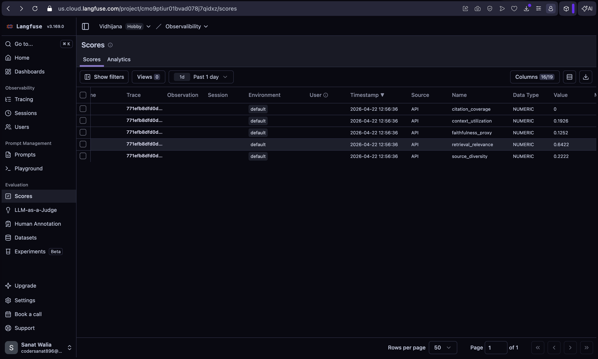

The Langfuse scores panel showing retrieval_relevance (0.64), context_utilization (0.19), citation_coverage (0.0), faithfulness_proxy (0.13), and source_diversity (0.22). The key insight here is that while retrieval relevance is good, the low utilization and zero citation coverage reveal the model is generating from memory — not from the retrieved context.

### 2. Trace Graph — Full Request
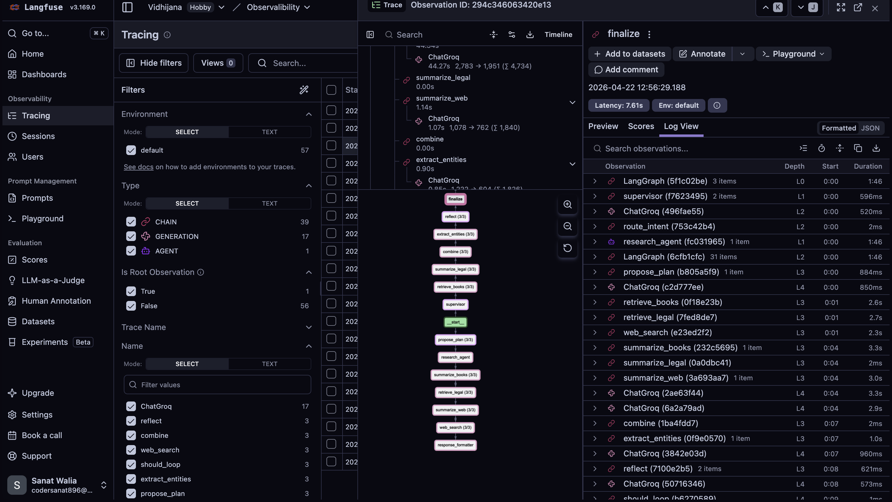

The full LangGraph trace tree for a deep research request. The root trace spans `supervisor` → `research_agent`, with nested spans for each node: `propose_plan`, `retrieve_legal`, `retrieve_books`, `web_search`, `summarize_books`, `summarize_web`, `combine`, `reflect`, `finalize`. This screenshot proves the multi-agent orchestration with a reflection loop is fully visible end-to-end.

### 3. Trace Content — Node Details
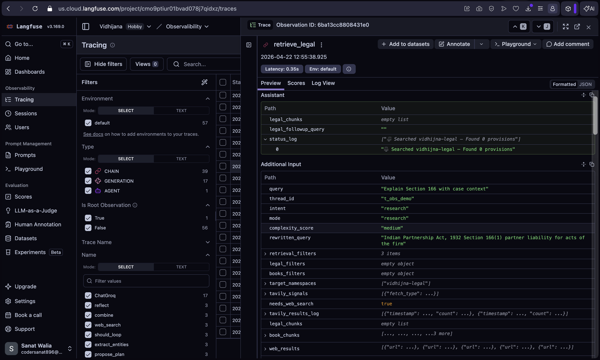
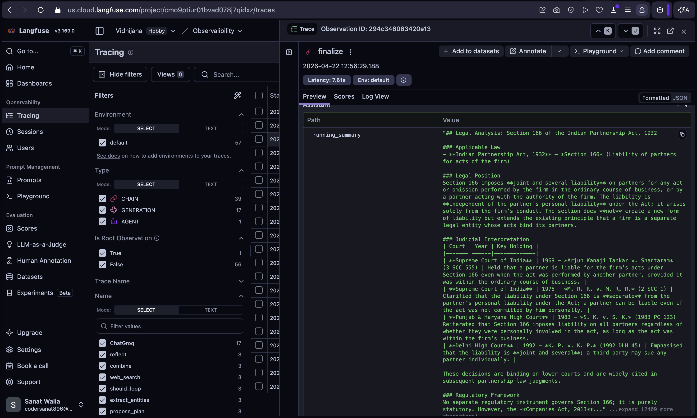
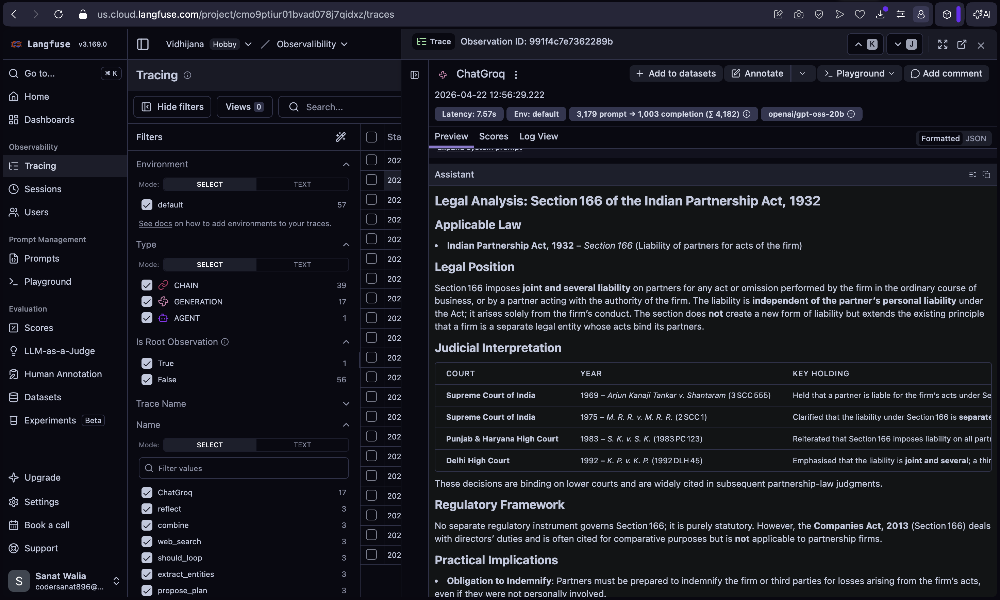

Clicking into individual spans shows the LLM input (the prompt) and output (the generated text). The "Content" tab in Langfuse shows exactly what was sent to the model at each node — useful for auditing whether the right context is being passed in.

### 4. Trace Types — Generation / Agent / Chain
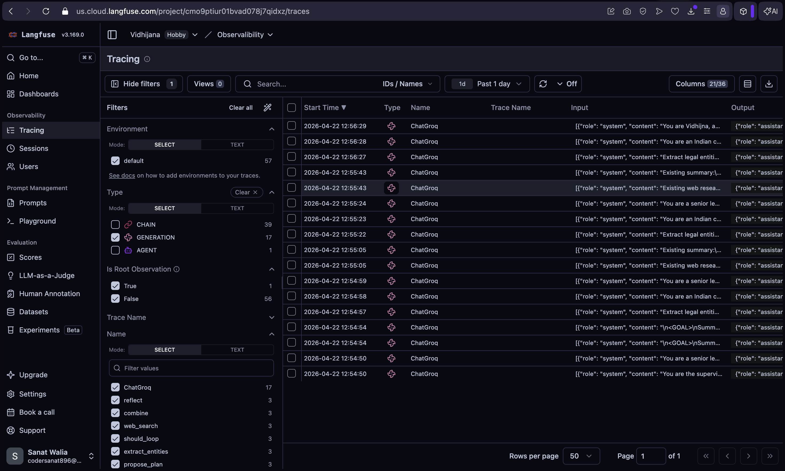
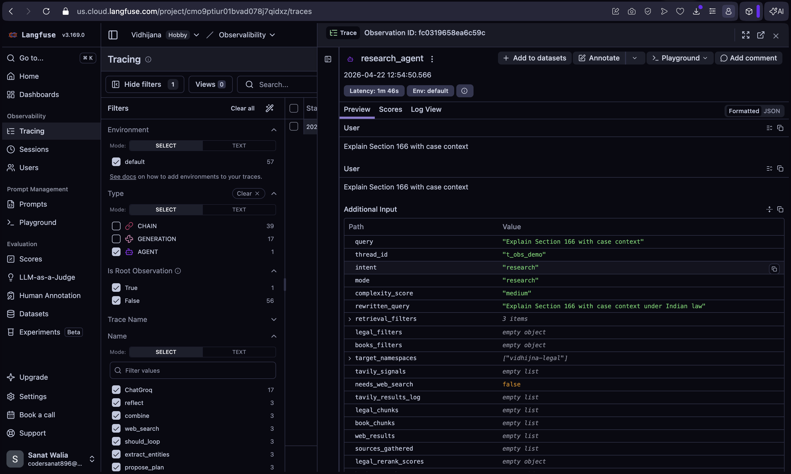
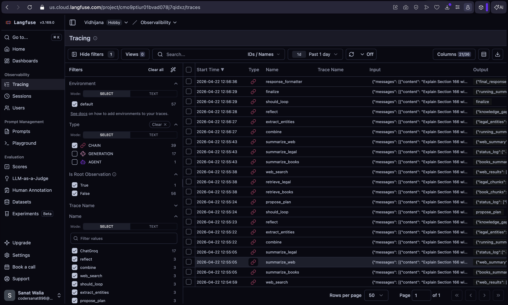

Langfuse differentiates between span types. **Generation spans** (the LLM icon) show token counts, latency, model name, and the full output. **Agent spans** show tool calls and intermediate reasoning. **Chain spans** show the routing edges between nodes. Together they give a complete picture of what the pipeline is doing at each step.

### 5. Metrics Endpoint Response
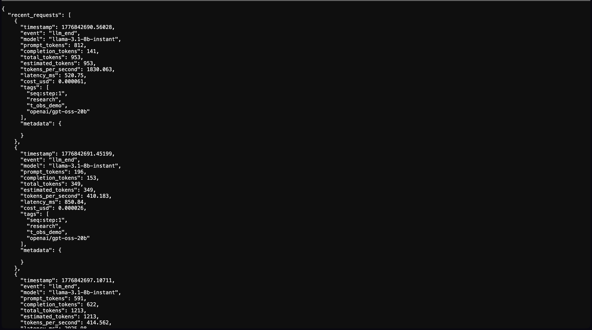
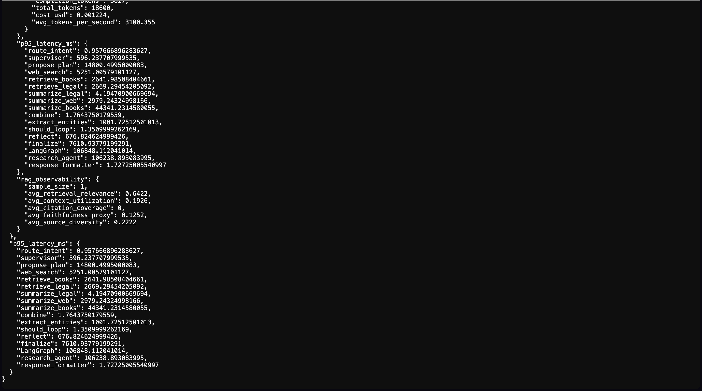

The `/metrics` endpoint JSON response showing the full summary breakdown — `by_role` token counts and costs, `p95_latency_ms` per node, and the aggregated RAG observability averages. This is the lightweight ops dashboard without opening Langfuse.

### Additional Trace Views
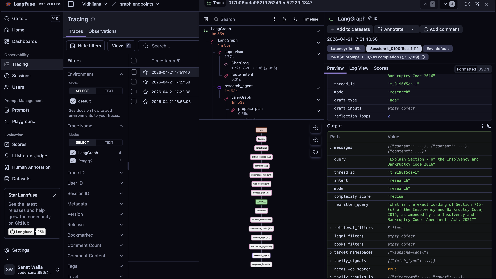

An alternate view of the same trace, showing the same spans structured differently — helpful to see the trace tree from a different angle.

---

## Suggested Demo Query

Use a query that naturally triggers multiple nodes and at least one reflection loop:

> "Legal Analysis: Director Duties and Oppression/Mis-management Remedies under the Companies Act, 2013 (with recent legal context)"

This produces a richer trace than a simple factual chat.

---

## Notes

- Observability is **opt-in** — if Langfuse env vars are missing, Vidhijna runs normally without tracing
- Tracing does not change the Cloud Run deployment path
- SSE streaming remains intact
