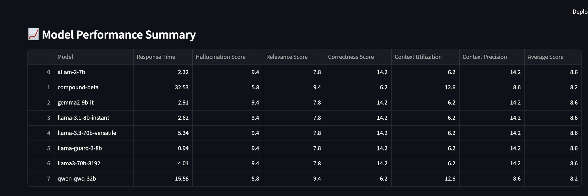

# Vidhijna

Vidhijna is a Python-based application designed to assist users in conducting comprehensive legal research on Indian law, inspired by and adapted from the [Local Deep Researcher](https://github.com/langchain-ai/local-deep-researcher) by LangChain AI. It takes a user-defined legal problem, generates optimized search queries, retrieves relevant information from legal databases and web sources, summarizes findings, and produces a cohesive legal analysis. Additionally, the project includes a model evaluation component to assess the performance of various Grok models on legal queries using OPIK metrics. The system leverages vector stores for legal documents, web search APIs, language models, and Streamlit for visualization of evaluation results.

## Table of Contents

- [Overview](#overview)
- [Features](#features)
- [Project Structure](#project-structure)
- [Installation](#installation)
- [Usage](#usage)
- [Workflow](#workflow)
- [Model Evaluation](#model-evaluation)
- [Screenshots](#screenshots)
- [Configuration](#configuration)
- [Dependencies](#dependencies)
- [Contributing](#contributing)
- [License](#license)
- [Acknowledgments](#acknowledgments)

## Overview

The Legal Research Assistant automates the process of legal research by:

1. Rewriting user queries into precise, legally-focused search terms suitable for Indian legal databases (e.g., Manupatra, Indian Kanoon, SCC Online) and web search engines.
2. Retrieving relevant documents from pre-indexed FAISS vector stores containing Indian laws and case law.
3. Performing web searches using APIs like DuckDuckGo, Tavily, or Perplexity to gather additional context, with the web research component adapted from the [Local Deep Researcher](https://github.com/langchain-ai/local-deep-researcher).
4. Summarizing and combining results from vector stores and web searches into a coherent legal analysis.
5. Reflecting on the research to identify gaps and generate follow-up queries, iterating until sufficient information is gathered.
6. Producing a final legal analysis with citations, recommendations, and structured formatting.

Additionally, the project includes a model evaluation module (`models_score_checker.py`) that evaluates different Grok models on legal queries using OPIK metrics such as Hallucination Score, Relevance Score, Correctness Score, Context Utilization, and Context Precision. The results are visualized using Streamlit, providing insights into model performance.

The system is built using a modular state graph (`langgraph`) to manage the research workflow, ensuring scalability and maintainability.

## Features

- **Query Rewriting**: Generates concise, legally-focused search queries tailored for Indian legal research.
- **Dual-Source Retrieval**: Retrieves documents from FAISS vector stores (laws and cases) and web searches.
- **Summarization**: Produces professional legal summaries with clear sections, citations, and analysis of statutes, case law, and legal principles.
- **Reflection and Iteration**: Identifies gaps in research and generates follow-up queries to deepen analysis.
- **Configurable Search**: Supports multiple web search APIs (DuckDuckGo, Tavily, Perplexity) and customizable research loops.
- **Legal Entity Extraction**: Identifies statutes, cases, jurisdictions, and other key legal entities for comprehensive analysis.
- **Final Analysis**: Combines all research into a structured legal report with practical recommendations.
- **Model Evaluation**: Evaluates Grok models on legal queries using OPIK metrics, with results visualized in a Streamlit app.
- **Visualization**: Displays model performance metrics (e.g., Correctness, Relevance, Context Utilization) in bar charts for easy comparison.

## Project Structure

The project consists of the following main files:

- **`state.py`**: Defines the `SummaryState`, `SummaryStateInput`, and `SummaryStateOutput` dataclasses to manage the state of the research process, including research topic, search queries, results, and summaries.
- **`prompts.py`**: Contains prompt templates for query rewriting, summarization, and reflection, ensuring legal accuracy and relevance for Indian law.
- **`configuration.py`**: Manages configuration settings, including search API selection, vector store paths, and LLM parameters, with environment variable support.
- **`graph.py`**: Implements the state graph using `langgraph`, defining nodes (e.g., query generation, retrieval, summarization) and edges for the research workflow.
- **`utils.py`**: Provides utility functions for loading FAISS vector stores, performing web searches (adapted from Local Deep Researcher), deduplicating sources, and formatting results.
- **`models_score_checker.py`**: Implements a Streamlit app to evaluate Grok models on legal queries using OPIK metrics, with visualization of results.

## Installation

1. **Clone the Repository**:

   ```bash
   git clone https://github.com/your-repo/legal-research-assistant.git
   cd legal-research-assistant
   ```

2. **Set Up a Virtual Environment**:

   ```bash
   python -m venv venv
   source venv/bin/activate  # On Windows: venv\Scripts\activate
   ```

3. **Install Dependencies**:

   ```bash
   pip install -r requirements.txt
   ```

4. **Set Environment Variables**:
   Create a `.env` file in the project root and configure the following:

   ```bash
   MAX_WEB_RESEARCH_LOOPS=3
   MAX_VECTOR_RESEARCH_LOOPS=1
   SEARCH_DEPTH=3
   OLLAMA_MODEL=gemma3:1b
   OLLAMA_BASE_URL=http://localhost:11434/
   SEARCH_API=duckduckgo
   FETCH_FULL_PAGE=False
   LAWS_FAISS_PATH=/path/to/laws_index
   CASES_FAISS_PATH=/path/to/cases_index
   TAVILY_API_KEY=your_tavily_api_key
   PERPLEXITY_API_KEY=your_perplexity_api_key
   DEV_MODE=True
   DEBUG_MODE=True
   LOG_DIR=logs
   ```

5. **Set Up FAISS Vector Stores**:
   Ensure FAISS indexes for laws and cases are available at the paths specified in `LAWS_FAISS_PATH` and `CASES_FAISS_PATH`. These should be pre-indexed with legal documents using the `all-minilm:33m` embedding model.

6. **Run Ollama LLM**:
   Ensure an Ollama server is running locally or at the specified `OLLAMA_BASE_URL` with the configured model (e.g., `gemma3:1b`).

## Usage

### Running the Legal Research Assistant

1. **Run the Application**:
   Execute the main script to start the research process:

   ```bash
   python main.py
   ```

2. **Provide a Research Topic**:
   Input a legal problem or topic (e.g., "Legal remedies for dowry-related abuse in India"). The system will:

   - Rewrite the query for optimal search.
   - Retrieve relevant laws and cases from FAISS vector stores.
   - Perform web searches using the configured API (e.g., DuckDuckGo), leveraging techniques inspired by the [Local Deep Researcher](https://github.com/langchain-ai/local-deep-researcher).
   - Summarize and combine results.
   - Reflect on gaps and iterate if needed.
   - Generate a final legal analysis.

3. **Output**:
   The system outputs a structured legal report in the `running_summary` field, including web and vector store summaries, citations, and recommendations.

### Running the Model Evaluator

1. **Run the Streamlit App**:
   Launch the Streamlit app to evaluate Grok models:

   ```bash
   streamlit run models_score_checker.py
   ```

2. **Evaluate Models**:

   - Select models to evaluate from the list (e.g., `llama-3.3-70b-versatile`, `llama-guard-3-8b`).
   - Choose test queries or add a custom query (e.g., "What are the key provisions of the Indian Contract Act regarding breach of contract?").
   - Click "Run Evaluations" to compute OPIK metrics for each model-query pair.

3. **View Results**:
   - The app displays a table of results, including metrics like Correctness Score, Relevance Score, and Hallucination Score.
   - A bar chart visualizes the performance of each model across different metrics.
   - Results can be exported as a CSV file.

## Workflow

The research process follows these steps, managed by the state graph in `graph.py`:

1. **Query Generation** (`generate_query`):

   - Takes the user’s research topic and generates a legally-focused search query using the `legal_query_rewriter_instructions` prompt.
   - Output: A JSON object with the query, legal aspect, and rationale.

2. **Vector Store Retrieval** (`retrieve_from_vector_stores`):

   - Queries FAISS vector stores for laws and cases using the generated query.
   - Filters results by similarity threshold (default: 0.7) and limits to a maximum number of documents (default: 5).

3. **Web Research** (`web_research`):

   - Performs web searches using the configured API (DuckDuckGo, Tavily, or Perplexity), with implementation inspired by the [Local Deep Researcher](https://github.com/langchain-ai/local-deep-researcher).
   - Deduplicates and formats results, optionally fetching full page content.

4. **Summarization**:

   - **Vector Summarization** (`summarize_vectors`): Summarizes retrieved laws and cases into a cohesive legal summary.
   - **Web Summarization** (`summarize_legal_sources`): Summarizes web search results, integrating with existing summaries if available.
   - **Combined Summarization** (`combine_summaries`): Merges vector and web summaries into a comprehensive report.

5. **Reflection** (`reflect_on_legal_research`):

   - Analyzes summaries for gaps or unclear areas.
   - Generates a follow-up query to deepen research if needed.

6. **Routing** (`route_research`):

   - If the maximum web research loops (`MAX_WEB_RESEARCH_LOOPS`) are reached, routes to finalization.
   - Otherwise, routes to another web research iteration with the new query.

7. **Finalization** (`finalize_legal_summary`):
   - Combines all research into a final legal analysis with citations and recommendations.
   - Outputs the result in `running_summary`.

## Model Evaluation

The `models_score_checker.py` script provides a Streamlit-based interface to evaluate Grok models on legal queries using OPIK metrics. The evaluation process includes:

1. **Model Selection**:

   - Users can select from a list of Grok models, such as `llama-3.3-70b-versatile`, `llama-guard-3-8b`, and `allam-2-7b`.

2. **Query Selection**:

   - Predefined legal queries are available, such as "What are the key provisions of the Indian Contract Act regarding breach of contract?".
   - Users can also add custom queries.

3. **Evaluation Metrics**:

   - **Hallucination Score**: Measures the extent of incorrect or fabricated information in the response.
   - **Relevance Score**: Assesses how relevant the response is to the query.
   - **Correctness Score**: Evaluates the factual accuracy of the response.
   - **Context Utilization**: Measures how well the model uses the provided context.
   - **Context Precision**: Assesses the precision of the context used in the response.
   - **Average Score**: Computes the average of the above metrics (adjusted for Hallucination Score).

4. **Visualization**:

   - Results are displayed in a table and a bar chart, comparing models across the OPIK metrics.
   - The bar chart shows scores for Correctness, Relevance, Context Utilization, Context Precision, and Average Score for each model.

5. **Export**:
   - Results can be downloaded as a CSV file for further analysis.

## Screenshots

### LangGraph Development Server

Below is a screenshot of the LangGraph development server, showing the state graph used to manage the legal research workflow:


### Streamlit frontend

This screenshot the frontend of my project , I have used streamlit for making this frontend


### Streamlit Model Evaluator - Results Summary Tab

This screenshot shows the "Results Summary" tab, displaying a bar chart of model performance across OPIK metrics:





_Caption: The "Results Summary" tab visualizes model performance with a bar chart, comparing Correctness, Relevance, Context Utilization, Context Precision, and Average Score._

## Configuration

The `configuration.py` file allows customization of:

- **Research Loops**: `MAX_WEB_RESEARCH_LOOPS` (default: 3), `MAX_VECTOR_RESEARCH_LOOPS` (default: 1).
- **Search Depth**: Number of web queries per loop (`SEARCH_DEPTH`, default: 3).
- **LLM Settings**: Model name (`OLLAMA_MODEL`, default: `gemma3:1b`) and server URL (`OLLAMA_BASE_URL`).
- **Search API**: Options include `duckduckgo`, `tavily`, or `perplexity` (`SEARCH_API`).
- **Vector Store Paths**: Paths to FAISS indexes for laws and cases (`LAWS_FAISS_PATH`, `CASES_FAISS_PATH`).
- **Developer Toggles**: Enable/disable `DEV_MODE` and `DEBUG_MODE` for logging and testing.

Set these via environment variables or a `RunnableConfig` object.

## Dependencies

- **Python**: 3.8+
- **langchain**: For document retrieval and text splitting.
- **langchain_ollama**: For LLM and embedding integration with Ollama.
- **langgraph**: For managing the state graph workflow.
- **tavily-python**: For Tavily search API (optional).
- **duckduckgo-search**: For DuckDuckGo search.
- **requests**: For Perplexity API calls.
- **beautifulsoup4**: For web scraping in DuckDuckGo full-page fetch.
- **faiss-cpu**: For vector store operations.
- **python-dotenv**: For environment variable management.
- **streamlit**: For the model evaluation interface.
- **pandas**: For data manipulation in the evaluator.
- **matplotlib**: For visualizing evaluation results.

Install dependencies using:

```bash
pip install langchain langchain_ollama langgraph tavily-python duckduckgo-search requests beautifulsoup4 faiss-cpu python-dotenv streamlit pandas matplotlib
```

## Contributing

Contributions are welcome! To contribute:

1. Fork the repository.
2. Create a feature branch (`git checkout -b feature/your-feature`).
3. Commit changes (`git commit -m 'Add your feature'`).
4. Push to the branch (`git push origin feature/your-feature`).
5. Open a pull request.

Please ensure code follows PEP 8 standards and includes tests for new functionality.

## License

This project is licensed under the MIT License. See the `LICENSE` file for details.

# Contributers:

<ol>
   <li>
      <a href="https://github.com/sanatwalia896">Sanat Walia</a>
   </li>
   <li>
      <a href="https://github.com/tanmay-vig">Tanmay Vig</a>
   </li>

</ol>

## Acknowledgments

This project was inspired by and builds upon the [Local Deep Researcher](https://github.com/langchain-ai/local-deep-researcher) by LangChain AI. The web research functionality, particularly the integration of multiple search APIs (DuckDuckGo, Tavily, Perplexity) and the deduplication and formatting of search results, is adapted from their work. We extend our gratitude to the LangChain AI team for their open-source contributions, which provided a foundation for the web research component of this project.
